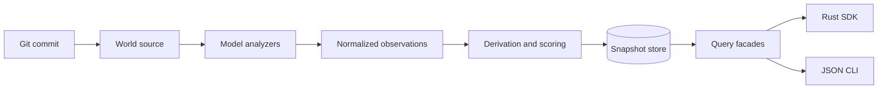

# Detamu

[](https://crates.io/crates/detamu)
[](https://docs.rs/detamu)
[](https://github.com/EntasisLabs/detamu/blob/main/LICENSE-MIT)

**Index Git repositories into immutable, queryable code graphs.**

Detamu turns observations from bounded worlds into versioned entity graphs with
provenance, measurements, and scores. Code is the first world model: index a
commit, persist the snapshot, then look up symbols, trace reverse dependencies,
and inspect AVEC risk scores with explicit gap reporting when evidence is
incomplete.

Use it as an embeddable Rust SDK or a standalone CLI. The engine is a thin host
around the SDK — there is no second implementation.

Detamu is building toward ACC-compatible repository graphs and AVEC scoring
behavior. It does not own agent runtimes or review workflows; host applications
remain authoritative for users and optional analyzer package lifecycle.

## What you can do today

- **Index a Git repository at an immutable commit** — tracked files, rename-aware
  history, Rust symbols via Tree-sitter, optional Lizard and rust-analyzer
  enrichment, and external LCOV/Cobertura coverage ingestion.
- **Query persisted snapshots** — filter entities, locate source lines, traverse
  reverse impact, diff snapshots, and report missing AVEC evidence instead of
  treating gaps as zero risk.
- **Embed or shell out** — compose analyzers through the SDK, or drive the same
  operations through JSON commands from `detamu-engine`.

## Try it in two minutes

Install the CLI ([`detamu-engine`](https://crates.io/crates/detamu-engine) on
crates.io):

```bash
cargo install detamu-engine
detamu doctor
detamu init ./data/detamu.surrealkv
detamu index . ./data/detamu.surrealkv
```

`index` prints the world and snapshot identifiers you need for queries:

```json
{
  "world": "code.repository:remote:github.com/your-org/your-repo",
  "snapshot": "83d4ba3f003799219ec5dcf28b1bb0a303bf2693",
  "entities": 720,
  "relations": 757,
  "coverage": "partial"
}
```

Query the graph (replace placeholders with your `index` output):

```bash
detamu snapshots ./data/detamu.surrealkv

detamu find ./data/detamu.surrealkv <WORLD> <SNAPSHOT> \
  --kind function --language rust --limit 10

detamu impact ./data/detamu.surrealkv <WORLD> <SNAPSHOT> <ENTITY_ID>

detamu gaps ./data/detamu.surrealkv <WORLD> <SNAPSHOT>
```

Index a specific commit without checking it out:

```bash
detamu index . ./data/detamu.surrealkv --revision abc123def
```

Optional analyzers (Lizard, rust-analyzer) are discovered from the environment
or a host-managed package directory — they are not bundled. See
[Analyzer runtimes](docs/RUNTIMES.md).

Full walkthrough: [Getting started](docs/GETTING_STARTED.md).

## Use it in Rust

```toml
[dependencies]
detamu = { version = "0.1", features = ["code", "runtime", "surreal"] }
tokio = { version = "1", features = ["macros", "rt-multi-thread"] }
```

Feature flags are additive: `query` and `runtime` (defaults), plus `code`,
`surreal`, or `full` for everything.

Runnable example from this repository:

```bash
cargo run -p detamu-index-and-query -- .
```

See [examples/](examples/) and [Querying Detamu](docs/QUERYING.md) for embedded
and JSON consumption contracts.

## How it works



World sources resolve an immutable revision. Analyzers emit normalized
observations; optional tools degrade gracefully. Derivers and scoring models
attach measurements and AVEC scores. The store commits each snapshot atomically.
Generic and code-aware query facades read the same persisted graph.

Details: [Architecture](ARCHITECTURE.md).

## Project status

**Works well**

- Git snapshot identity, tracked-file inventory, and bulk rename-aware history.
- In-process Rust Tree-sitter analysis without optional runtimes.
- SurrealKV persistence, snapshot listing, entity search, impact traversal,
  content-aware diffs, and AVEC gap reports.
- Optional Lizard, rust-analyzer, and coverage report ingestion.

**Partial or optional**

- AVEC scores require complete evidence; missing semantic or coverage data is
  reported explicitly rather than scored as zero.
- Broad multi-language metrics depend on an installed Lizard binary.
- Call graphs and references depend on rust-analyzer when available.

**Next**

- C# semantic adapter over the generic LSP host.
- Richer import resolution and ACC graph golden comparisons.

## Documentation

| Doc | Contents |
|---|---|
| [Getting started](docs/GETTING_STARTED.md) | CLI install, SDK setup, coverage, persistence |
| [Querying Detamu](docs/QUERYING.md) | Rust facades and JSON command protocol |
| [Analyzer runtimes](docs/RUNTIMES.md) | Optional executable discovery and host packages |
| [Architecture](ARCHITECTURE.md) | Kernel boundaries, analyzers, storage, roadmap |
| [Publishing](docs/PUBLISHING.md) | crates.io release procedure |
| [Contributing](CONTRIBUTING.md) | Checks, constraints, and pull request expectations |
| [Examples](examples/) | Runnable workspace examples |

## Key crates

Most consumers should start with these:

| Crate | Role |
|---|---|
| [`detamu`](https://crates.io/crates/detamu) | Public facade (`code`, `query`, `runtime`, `surreal` features) |
| [`detamu-engine`](https://crates.io/crates/detamu-engine) | Standalone CLI and JSON protocol host |
| [`detamu-sdk`](https://crates.io/crates/detamu-sdk) | Model-agnostic orchestration for embedders |
| [`detamu-source-git`](https://crates.io/crates/detamu-source-git) | Git repository source adapter |

The workspace also contains kernel types, the code ontology, language adapters,
storage backends, and query facades. See [Architecture](ARCHITECTURE.md) for the
full crate map and dependency direction.

## Development

```bash
cargo test --workspace
cargo clippy --workspace --all-targets -- -D warnings
```

See [Contributing](CONTRIBUTING.md) for formatting, architecture constraints,
and release checks.

## License

Detamu is dual-licensed under [MIT](LICENSE-MIT) OR [Apache-2.0](LICENSE-APACHE).
