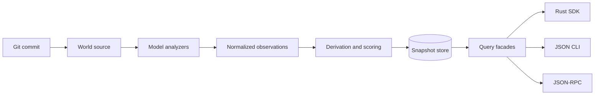

# Detamu

[](https://crates.io/crates/detamu)
[](https://docs.rs/detamu)
[](https://github.com/EntasisLabs/detamu/blob/main/LICENSE-MIT)

**Index Git repositories into immutable, queryable code graphs.**

Detamu turns observations from bounded worlds into versioned entity graphs with
provenance, measurements, and scores. Code is the first world model: index a
commit, persist the snapshot, then look up symbols, trace reverse dependencies,
and score how risky each piece of code is to change.

Use it as an embeddable Rust SDK or a standalone CLI. The engine is a thin host
around the SDK — there is no second implementation.

Detamu is building toward ACC-compatible repository graphs and their scoring
behavior. It does not own agent runtimes or review workflows; host applications
remain authoritative for users and optional analyzer package lifecycle.

## What you can do today

- **Index a Git repository at an immutable commit** — tracked files, rename-aware
  history, Rust symbols via Tree-sitter, optional Lizard and rust-analyzer
  enrichment, and external LCOV/Cobertura coverage ingestion. Source is read in
  groups of about 4 MiB and Git history is streamed, so peak memory stays near
  one group plus the graph being written.
- **Query persisted snapshots** — filter entities, locate source lines, traverse
  dependencies in either direction, rank high-friction and unstable symbols,
  find similar AVEC profiles, summarize score statistics, diff snapshots, and
  list where scoring evidence is still missing instead of inventing zeros.
- **Hook any language server** — register a stdio command for a language, then
  index the committed tree through it. The same queries and registration are
  available over JSON-RPC, including the `acc.` method names an existing ACC
  client already sends.
- **Score code with AVEC** — four versioned dimensions for each scoreable symbol
  (see below).
- **Embed or shell out** — compose analyzers through the SDK, or drive the same
  operations through JSON commands from the `detamu` CLI.

## Scoring (AVEC Code)

AVEC Code is Detamu's built-in scoring model for the code world. When enough
measurements exist, each symbol gets four 0–1 scores:

| Dimension | Roughly answers | Drawn from |
|---|---|---|
| **Stability** | How settled is this code? | Churn, contributor count, test coverage |
| **Logic** | How dense is the implementation? | Cyclomatic complexity, size, parameters |
| **Friction** | How costly is a change here? | Graph centrality, inbound deps, history, complexity |
| **Autonomy** | How independent is it? | Outbound dependency load |

Scores are derived and versioned (`avec.code`, formula version 1). They follow
ACC's documented weights. Coverage is stored as a 0–1 ratio, which lines up with
ACC's 0–100 percentages, and dependency edges keep ACC's relative weights
(inherits and implements 1.0, calls 0.7, imports 0.5, references 0.3). If
required evidence is missing — for example no call graph yet, or no coverage
report — Detamu leaves the score out and `detamu gaps` explains why. Missing
evidence is never treated as “safe.”

## Try it in two minutes

The user-facing program is the `detamu` binary from the
[`detamu-engine`](https://crates.io/crates/detamu-engine) crate. Build it from
crates.io, or install a GitHub Release archive for Linux x86_64, macOS arm64,
macOS x86_64, or Windows x86_64. Release archives appear when a `v*` tag is
pushed; `scripts/install.sh` checks the archive against `sha256sums.txt`.

```bash
cargo install detamu-engine

# After a release tag exists. Pin one with DETAMU_VERSION=v0.2.0.
curl -fsSL https://raw.githubusercontent.com/EntasisLabs/detamu/main/scripts/install.sh | bash

detamu doctor
detamu init ./data/detamu.surrealkv
detamu index . ./data/detamu.surrealkv
```

`index` prints the world and snapshot identifiers you need for queries:

```json
{
  "world": "code.repository:remote:github.com/your-org/your-repo",
  "snapshot": "83d4ba3f003799219ec5dcf28b1bb0a303bf2693",
  "entities": 720,
  "relations": 757,
  "analyzers_run": 4,
  "analyzers_skipped": 1,
  "derivers_run": 1,
  "language_servers": 0,
  "coverage_reports": 0,
  "coverage": "partial"
}
```

Query the graph (replace placeholders with your `index` output):

```bash
detamu snapshots ./data/detamu.surrealkv

detamu find ./data/detamu.surrealkv <WORLD> <SNAPSHOT> \
  --kind function --language rust --limit 10

detamu impact ./data/detamu.surrealkv <WORLD> <SNAPSHOT> <ENTITY_ID>

detamu gaps ./data/detamu.surrealkv <WORLD> <SNAPSHOT>

detamu dependencies ./data/detamu.surrealkv <WORLD> <SNAPSHOT> <ENTITY_ID>

detamu friction ./data/detamu.surrealkv <WORLD> <SNAPSHOT>

detamu unstable ./data/detamu.surrealkv <WORLD> <SNAPSHOT>

detamu patterns ./data/detamu.surrealkv <WORLD> <SNAPSHOT> \
  --stability 0.8 --logic 0.2 --friction 0.7 --autonomy 0.5

detamu stats ./data/detamu.surrealkv <WORLD> <SNAPSHOT>

detamu lsp register ./data/detamu.surrealkv \
  --id python --language python --command pyright-langserver \
  --arg --stdio --ext py

detamu serve ./data/detamu.surrealkv
```

Index a specific commit without checking it out:

```bash
detamu index . ./data/detamu.surrealkv --revision abc123def
```

Optional analyzers (Lizard, rust-analyzer) are discovered from the environment
or a host-managed package directory — they are not bundled. See
[Analyzer runtimes](docs/RUNTIMES.md).

Full walkthrough: [Getting started](docs/GETTING_STARTED.md).

## Use it in Rust

```toml
[dependencies]
detamu = { version = "0.2", features = ["code", "runtime", "surreal"] }
tokio = { version = "1", features = ["macros", "rt-multi-thread"] }
```

Feature flags are additive: `query` and `runtime` (defaults), plus `code`,
`surreal`, `rpc` (the JSON-RPC handler, including language-server registration),
or `full` for everything. Embedders attach that handler to a TCP socket, a Unix
socket, or stdin with `with_listener`.

Runnable example from this repository:

```bash
cargo run -p detamu-index-and-query -- .
```

See [examples/](examples/) and [Querying Detamu](docs/QUERYING.md) for embedded
and JSON consumption contracts.

## How it works


```mermaid
flowchart LR
  Git[Git commit] --> Source[World source]
  Source --> Analyzers[Model analyzers]
  Analyzers --> Batch[Normalized observations]
  Batch --> Derive[Derivation and scoring]
  Derive --> Store[(Snapshot store)]
  Store --> Query[Query facades]
  Query --> SDK[Rust SDK]
  Query --> CLI[JSON CLI]
  Query --> RPC[JSON-RPC]
```

World sources resolve an immutable revision. Analyzers emit normalized
observations; optional tools degrade gracefully. Derivers attach graph metrics
and coverage; AVEC Code then scores symbols that have enough evidence. The store
commits each snapshot atomically. Generic and code-aware query facades read the
same persisted graph.

Details: [Architecture](ARCHITECTURE.md).

## Project status

**Works well**

- Git snapshot identity, tracked-file inventory, and bulk rename-aware history.
- In-process Rust Tree-sitter analysis without optional runtimes.
- SurrealKV persistence, snapshot listing, entity search, impact traversal,
  content-aware diffs, and scoring gap reports.
- Dependency, pattern, friction, unstable, and stats queries on the CLI and
  over JSON-RPC (`detamu.` and `acc.` method names) on port 9339.
- Optional Lizard, rust-analyzer, and coverage report ingestion.
- Registration of any stdio language server, stored beside the database and
  launched on the next `detamu index`.

**Partial or optional**

- AVEC Code only scores when required measurements exist; incomplete analysis is
  reported by `gaps` rather than filled with zeros.
- Broad multi-language metrics depend on an installed Lizard binary.
- Call graphs and references come from rust-analyzer, or from any language
  server registered with `detamu lsp`. The server itself is supplied by the host.

**Next**

- Richer import resolution and ACC graph golden comparisons.

## Documentation

| Doc | Contents |
|---|---|
| [Getting started](docs/GETTING_STARTED.md) | CLI install, SDK setup, coverage, persistence |
| [Querying Detamu](docs/QUERYING.md) | Rust facades and JSON command protocol |
| [Analyzer runtimes](docs/RUNTIMES.md) | Optional executable discovery and host packages |
| [Architecture](ARCHITECTURE.md) | Kernel boundaries, analyzers, storage, roadmap |
| [Publishing](docs/PUBLISHING.md) | crates.io release procedure |
| [Contributing](CONTRIBUTING.md) | Checks, constraints, and pull request expectations |
| [Examples](examples/) | Runnable workspace examples |

## Key crates

Most consumers should start with these:

| Crate | Role |
|---|---|
| [`detamu`](https://crates.io/crates/detamu) | Public facade (`code`, `query`, `runtime`, `surreal`, `rpc` features) |
| [`detamu-engine`](https://crates.io/crates/detamu-engine) | Standalone `detamu` CLI and JSON-RPC host |
| [`detamu-sdk`](https://crates.io/crates/detamu-sdk) | Model-agnostic orchestration for embedders |
| [`detamu-source-git`](https://crates.io/crates/detamu-source-git) | Git repository source adapter |

The workspace also contains kernel types, the code ontology, language adapters,
storage backends, and query facades. See [Architecture](ARCHITECTURE.md) for the
full crate map and dependency direction.

## Development

```bash
cargo fmt --all --check
cargo clippy --workspace --all-targets --all-features -- -D warnings
cargo test --workspace --locked
```

GitHub Actions runs those checks on pull requests and on pushes to `main`.
See [Contributing](CONTRIBUTING.md) for architecture constraints and release
checks.

## License

Detamu is dual-licensed under [MIT](LICENSE-MIT) OR [Apache-2.0](LICENSE-APACHE).
